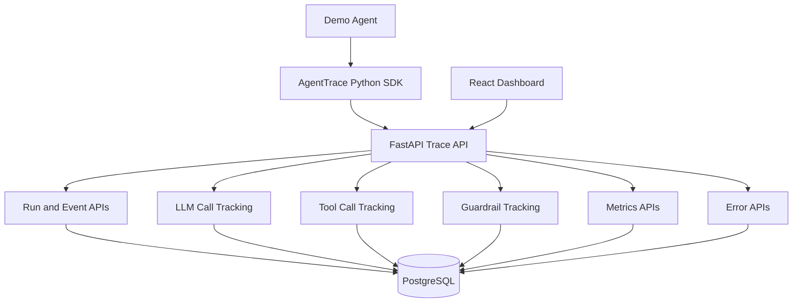

# AgentTrace

AgentTrace is a full-stack AI-agent observability system for capturing, storing, and visualizing agent execution traces.

It records agent runs, LLM calls, tool calls, guardrail checks, errors, latency, token usage, estimated cost, and execution timelines.

The project is built around a practical engineering question:

> When an AI agent runs, what happened step by step, which tools were called, what failed, how long did it take, and how much did it cost?

AgentTrace is designed as a developer-focused observability project for understanding, debugging, and reviewing AI-agent behavior across backend APIs, SDK instrumentation, database persistence, and a React dashboard.

---

## What This Demonstrates

This project demonstrates several production-relevant engineering patterns for AI-agent systems:

- Trace ingestion API design
- Agent run and event modeling
- LLM call and tool-call observability
- Guardrail and error-event tracking
- Python SDK-based instrumentation
- PostgreSQL persistence for structured trace data
- Metrics APIs for dashboard reporting
- React-based trace visualization
- Local Docker-based development workflow
- Backend testing with Pytest

---

## Repository Structure

```text
agent-trace/
├── agent-trace-api/      FastAPI trace ingestion and metrics service
├── agent-trace-sdk/      Python SDK for instrumenting agent runs
├── agent-trace-web/      React dashboard for visualizing runs and timelines
├── docs/                 Architecture, trace model, API design, and roadmap
├── docker-compose.yml    PostgreSQL service for local development
├── README.md
├── LICENSE
└── .gitignore
```

---

## What the Project Includes

- FastAPI trace ingestion API
- PostgreSQL persistence
- SQLAlchemy data model
- Python SDK wrapper for instrumenting agent runs
- Demo agent that generates trace events
- React + TypeScript dashboard
- Run list page
- Run detail timeline page
- Basic metrics summary
- Error list
- Pytest backend tests
- Documentation for architecture, trace model, API design, and roadmap
- Docker Compose setup for local PostgreSQL

---

## Architecture



---

## Local Setup

### Prerequisites

Install these locally:

- Docker Desktop
- Python 3.12+
- uv
- Node.js 18+
- npm

Install `uv` on macOS:

```bash
brew install uv
```

Verify the tools:

```bash
uv --version
node --version
npm --version
docker --version
docker compose version
```

---

## 1. Start PostgreSQL

From the repository root:

```bash
docker compose up -d
```

Confirm the database container is running:

```bash
docker ps
```

PostgreSQL runs locally at:

```text
localhost:5432
```

Default local credentials:

```text
Database: agenttrace
User: agenttrace
Password: agenttrace
```

These credentials are for local development only. Do not reuse them in production or expose them in deployed environments.

---

## 2. Run the API

Open a new terminal:

```bash
cd agent-trace-api
cp .env.example .env
uv sync --dev
uv run uvicorn app.main:app --reload
```

API:

```text
http://127.0.0.1:8000
```

Swagger UI:

```text
http://127.0.0.1:8000/docs
```

Health check:

```bash
curl http://127.0.0.1:8000/health
```

Expected response:

```json
{"status":"ok","service":"agent-trace-api"}
```

---

## 3. Generate Demo Trace Data

Open a second terminal:

```bash
cd agent-trace-sdk
uv sync --dev
uv run python examples/demo_agent.py
```

The demo agent simulates this workflow:

1. Start an agent run.
2. Simulate an LLM planning call.
3. Simulate a `web_search` tool call.
4. Simulate a `summarizer` tool call.
5. Record a guardrail check.
6. Simulate a final LLM response.
7. Mark the run completed.

The project intentionally uses a mock demo agent first, so reviewers can run the system locally without requiring OpenAI, Anthropic, or other external AI-provider API keys.

---

## 4. Run the Web Dashboard

Open a third terminal:

```bash
cd agent-trace-web
cp .env.example .env
npm install
npm run dev
```

Open:

```text
http://127.0.0.1:5173
```

The dashboard shows:

- Metrics summary
- Recent agent runs
- Run detail timeline
- LLM events
- Tool-call events
- Guardrail events
- Error list

---

## Stop Local Services

Stop the API and web dashboard by pressing:

```text
CTRL + C
```

Stop PostgreSQL from the repository root:

```bash
docker compose down
```

To remove local database volumes as well:

```bash
docker compose down -v
```

Use `-v` carefully because it deletes local PostgreSQL data.

---

## API Overview

| Method | Endpoint | Purpose |
|---|---|---|
| `GET` | `/health` | Service health check |
| `POST` | `/api/runs` | Create a new agent run |
| `GET` | `/api/runs` | List agent runs |
| `GET` | `/api/runs/{run_id}` | Get one agent run |
| `POST` | `/api/runs/{run_id}/events` | Add a trace event |
| `GET` | `/api/runs/{run_id}/timeline` | Get run timeline |
| `GET` | `/api/metrics/summary` | Get dashboard metrics |
| `GET` | `/api/metrics/tools` | Get tool usage metrics |
| `GET` | `/api/metrics/models` | Get model usage metrics |
| `GET` | `/api/errors` | List recorded errors |

---

## Example Trace Event

```json
{
  "event_type": "tool_call_completed",
  "step_name": "web_search",
  "status": "success",
  "duration_ms": 340,
  "metadata": {
    "query": "AI agent observability",
    "result_count": 5
  },
  "tool_call": {
    "tool_name": "web_search",
    "input": {
      "query": "AI agent observability"
    },
    "output_summary": "Found 5 relevant sources",
    "latency_ms": 340,
    "status": "success"
  }
}
```

---

## Running Tests

From `agent-trace-api/`:

```bash
uv run pytest
```

The backend tests cover:

- Health check
- Run creation
- Event ingestion
- Timeline retrieval
- Metrics summary
- Error capture

---

## Design Notes

### Why PostgreSQL?

PostgreSQL makes the project closer to a production-style observability backend. It supports structured relational data while still allowing flexible JSON metadata for trace events, LLM calls, tool calls, and guardrail decisions.

### Why include a Python SDK?

The SDK makes the project feel like a developer platform rather than only a web application. Agents can emit traces through a simple wrapper instead of manually calling API endpoints.

### Why use a mock demo agent first?

The demo agent keeps local setup simple and reviewable. It allows the trace ingestion API, SDK, database model, and dashboard to be tested without relying on external AI-provider credentials.

---

## Security Notes

- Local `.env` files are ignored by Git.
- Default database credentials are intended only for local development.
- The demo agent does not require external AI-provider API keys.
- Trace payloads may contain tool inputs, output summaries, and metadata; avoid sending secrets or sensitive production data into local traces.
- The project is designed for local development and portfolio review, not direct production deployment without additional hardening.

Recommended production hardening would include:

- Authentication and authorization
- Tenant isolation
- Secret redaction
- Input validation policies
- Rate limiting
- Audit retention controls
- TLS termination
- Secure deployment configuration

---

## Development Commands

Start PostgreSQL:

```bash
docker compose up -d
```

Run the API:

```bash
cd agent-trace-api
uv run uvicorn app.main:app --reload
```

Run backend tests:

```bash
cd agent-trace-api
uv run pytest
```

Run the demo agent:

```bash
cd agent-trace-sdk
uv run python examples/demo_agent.py
```

Run the dashboard:

```bash
cd agent-trace-web
npm run dev
```

Stop PostgreSQL:

```bash
docker compose down
```

---

## Documentation

See:

- [`docs/architecture.md`](docs/architecture.md)
- [`docs/trace-model.md`](docs/trace-model.md)
- [`docs/api-design.md`](docs/api-design.md)
- [`docs/roadmap.md`](docs/roadmap.md)

---

## License

This project is licensed under the MIT License. See [LICENSE](LICENSE).