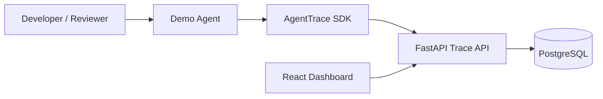

# AgentTrace Architecture

AgentTrace is built as a local developer platform for AI-agent observability. The MVP contains three main runtime components and one documentation layer:

```text
agent-trace-api   FastAPI + PostgreSQL trace ingestion service
agent-trace-sdk   Python client library for emitting traces
agent-trace-web   React dashboard for reviewing runs and metrics
docs              Architecture, data model, API design, and roadmap
```

## System Context



## Runtime Flow

1. A demo agent receives a task.
2. The agent starts a new trace run through the SDK.
3. The SDK sends `POST /api/runs` to the FastAPI service.
4. The agent performs simulated LLM calls, tool calls, and guardrail checks.
5. The SDK emits trace events through `POST /api/runs/{run_id}/events`.
6. The API stores normalized records in PostgreSQL.
7. The dashboard fetches runs, timeline events, metrics, and errors.
8. The user reviews the execution path in the UI.

## Backend Responsibilities

The API owns:

- Run creation and lifecycle status
- Trace event ingestion
- LLM call metadata storage
- Tool call metadata storage
- Guardrail check storage
- Error capture
- Metrics aggregation
- Dashboard read APIs

## SDK Responsibilities

The SDK owns:

- A clean developer-facing tracing interface
- Run lifecycle helpers
- Event emission helpers
- LLM/tool/guardrail convenience methods
- Error reporting helpers

## Frontend Responsibilities

The dashboard owns:

- Displaying summary metrics
- Listing agent runs
- Rendering run timelines
- Displaying event metadata
- Showing tool/model/error usage summaries
